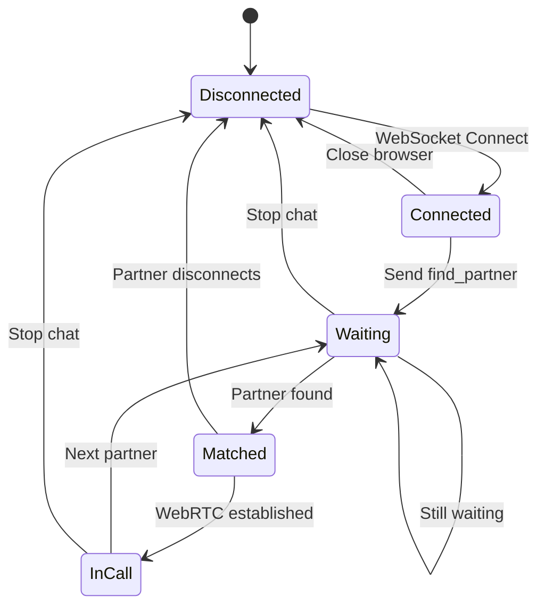
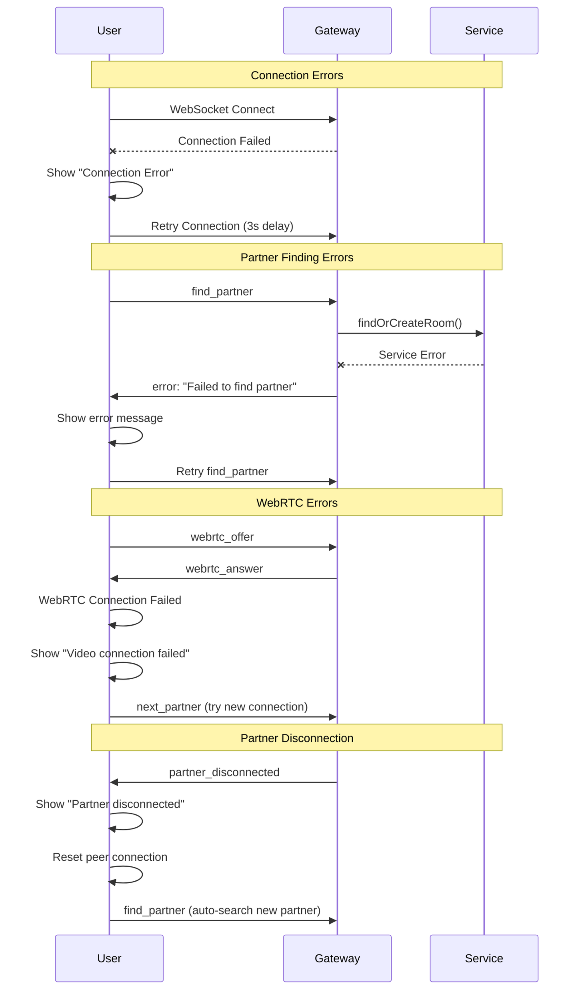

# Video Chat Application - Sequence Diagrams

## 🔄 Complete User Journey Sequence

```mermaid
sequenceDiagram
    participant UA as User A Browser
    participant UB as User B Browser
    participant GW as WebSocket Gateway
    participant VS as Video Chat Service
    participant MS as Memory Storage

    Note over UA, MS: Initial Connection Phase
    UA->>GW: WebSocket Connect
    GW->>UA: Connected + UserID
    Note over UA: User clicks "Start Chat"
    UA->>GW: find_partner
    
    GW->>VS: findOrCreateRoom(userA)
    VS->>MS: Check waiting users
    MS-->>VS: Empty waiting list
    VS->>MS: Add userA to waiting
    VS->>MS: Create room with userA
    MS-->>VS: Room created
    VS-->>GW: Room object (1 user)
    GW->>UA: waiting_for_partner

    Note over UA, MS: Partner Matching Phase
    UB->>GW: WebSocket Connect  
    GW->>UB: Connected + UserID
    Note over UB: User clicks "Start Chat"
    UB->>GW: find_partner
    
    GW->>VS: findOrCreateRoom(userB)
    VS->>MS: Check waiting users
    MS-->>VS: Found userA waiting
    VS->>MS: Remove userA from waiting
    VS->>MS: Add userB to userA's room
    MS-->>VS: Room updated (2 users)
    VS-->>GW: Room object (2 users)
    
    GW->>UA: partner_found (isInitiator: false)
    GW->>UB: partner_found (isInitiator: true)

    Note over UA, MS: WebRTC Signaling Phase
    UB->>GW: webrtc_offer
    GW->>UA: webrtc_offer
    UA->>GW: webrtc_answer
    GW->>UB: webrtc_answer
    
    UA->>GW: ice_candidate
    GW->>UB: ice_candidate
    UB->>GW: ice_candidate
    GW->>UA: ice_candidate

    Note over UA, UB: Direct P2P Video Connection Established
    UA<-->UB: Video/Audio Streams (Direct WebRTC)

    Note over UA, MS: Chat Message Exchange
    UA->>GW: chat_message
    GW->>UB: chat_message
    UB->>GW: chat_message  
    GW->>UA: chat_message

    Note over UA, MS: User Disconnection
    UA->>GW: next_partner
    GW->>VS: leaveRoom(userA)
    VS->>MS: Remove userA from room
    GW->>UB: partner_left
    GW->>VS: findOrCreateRoom(userA)
    Note over UA: Starts looking for new partner...
```

## 🔄 WebRTC Connection Establishment

```mermaid
sequenceDiagram
    participant UA as User A
    participant GW as Gateway
    participant UB as User B
    participant STUN as STUN Server

    Note over UA, STUN: WebRTC Offer/Answer Exchange
    UA->>UA: Create RTCPeerConnection
    UA->>UA: Add local media stream
    UA->>UA: Create offer
    UA->>GW: webrtc_offer
    GW->>UB: webrtc_offer
    
    UB->>UB: Create RTCPeerConnection
    UB->>UB: Add local media stream
    UB->>UB: Set remote description (offer)
    UB->>UB: Create answer
    UB->>GW: webrtc_answer
    GW->>UA: webrtc_answer
    UA->>UA: Set remote description (answer)

    Note over UA, STUN: ICE Candidate Exchange
    UA->>STUN: Gather ICE candidates
    STUN-->>UA: ICE candidates
    UA->>GW: ice_candidate
    GW->>UB: ice_candidate
    UB->>UB: Add ICE candidate

    UB->>STUN: Gather ICE candidates  
    STUN-->>UB: ICE candidates
    UB->>GW: ice_candidate
    GW->>UA: ice_candidate
    UA->>UA: Add ICE candidate

    Note over UA, UB: Connection Established
    UA<-->UB: Direct P2P Media Stream
    UA->>UB: Video/Audio packets
    UB->>UA: Video/Audio packets
```

## 🔄 Room Management Lifecycle



## 🔄 Message Flow Architecture

```mermaid
graph TD
    A[User A Browser] -->|WebSocket| B[Gateway]
    C[User B Browser] -->|WebSocket| B
    D[User C Browser] -->|WebSocket| B
    
    B --> E[Video Chat Service]
    E --> F[(In-Memory Storage)]
    
    F --> G[Rooms Map]
    F --> H[User-Room Map]
    F --> I[Waiting Users Array]
    
    B --> J[HTTP Controller]
    J --> K[/stats endpoint]
    J --> L[/health endpoint]
    J --> M[/rooms endpoint]
    
    N[Load Balancer] --> B
    O[Admin Dashboard] --> N
    
    style A fill:#e1f5fe
    style C fill:#e1f5fe  
    style D fill:#e1f5fe
    style B fill:#f3e5f5
    style E fill:#e8f5e8
    style F fill:#fff3e0
```

## 🔄 Error Handling Flow


